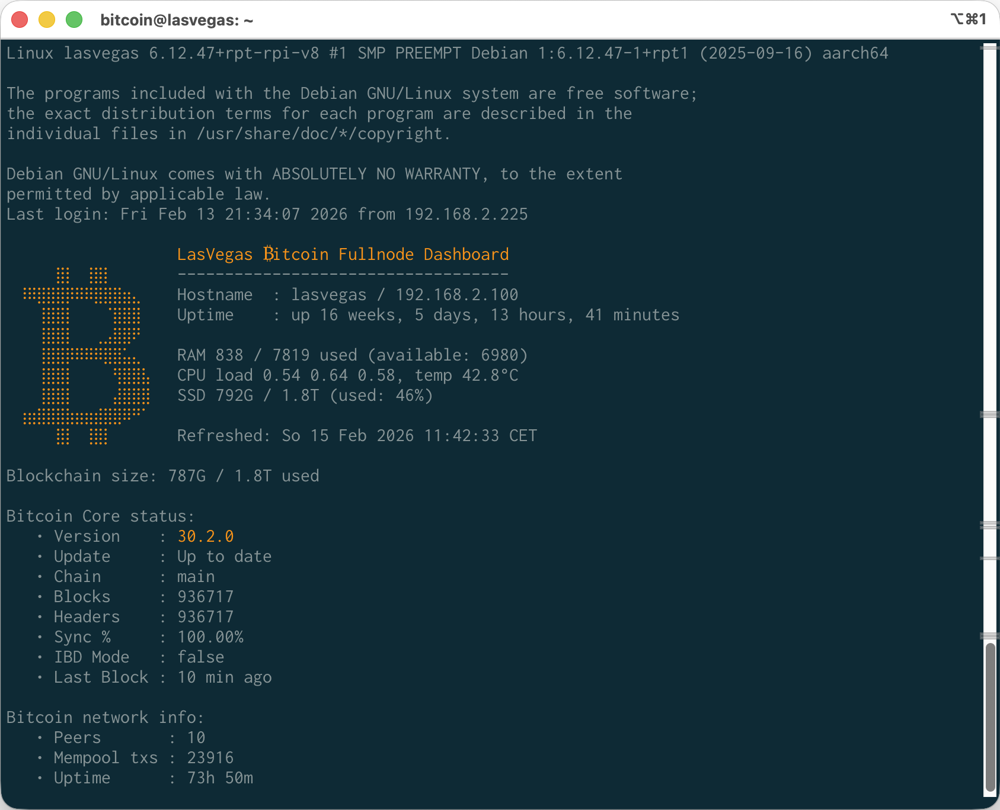

# Bitcoin Node Dashboard

A terminal dashboard for monitoring a Bitcoin full node on Raspberry Pi. Displays host stats, resource usage, blockchain sync status, peer count and mempool info.

## Included Script
`dashboard.sh` prints the terminal dashboard.



## Installation

**Prerequisites** — the script requires `jq`, `bc`, and `curl`:
```bash
sudo apt install -y jq bc curl
```

**1. Clone the repository**
```bash
git clone https://github.com/janrothen/bitcoin-node-dashboard.git ~/bitcoin-node-dashboard
```

**2. Make the script executable**
```bash
chmod +x ~/bitcoin-node-dashboard/dashboard.sh
```

**3. Run it**
```bash
~/bitcoin-node-dashboard/dashboard.sh
```

**Optional: run on login**

Add the following line to `~/.bashrc` (or `~/.bash_profile`) to display the dashboard every time you open a shell (adjust the path accordingly):
```bash
echo '~/bitcoin-node-dashboard/dashboard.sh' >> ~/.bashrc
```